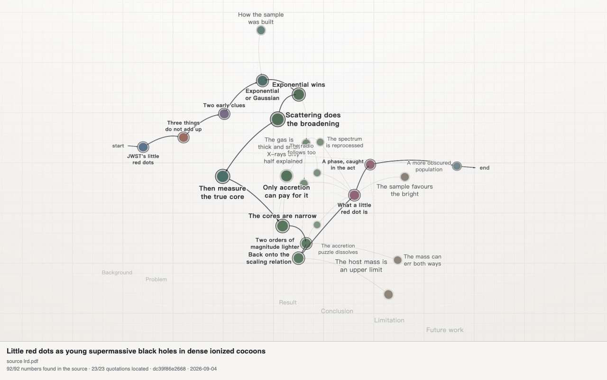
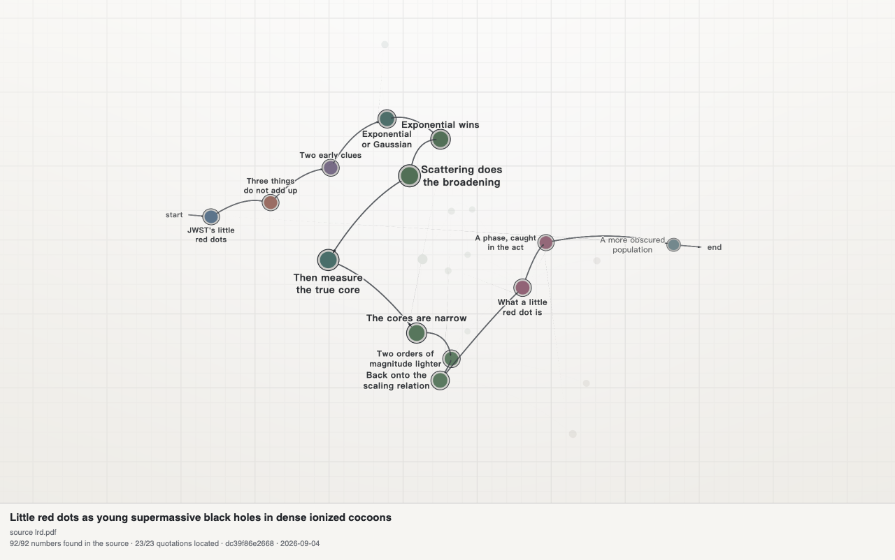

# argument-map

[English](README.md) | **简体中文**

<div align="center">

**把难读的论文，变成一张可以探索的论证地图。**

经过来源核验的论据、可交互的 3D 推理图，以及一个自包含的 HTML 文件。

[](https://github.com/Mojiajun2022/argument-map/actions/workflows/ci.yml)
[](https://github.com/Mojiajun2022/argument-map/stargazers)
[](LICENSE)
[](https://www.python.org/)

[**在线打开实例 Demo**](https://htmlpreview.github.io/?https://raw.githubusercontent.com/Mojiajun2022/argument-map/main/demo.html) | [下载 Demo HTML](demo.html) | [英文文档](README.md)



<sub>如果它帮你更快读懂了一篇难论文，欢迎 <a href="https://github.com/Mojiajun2022/argument-map">点个 Star</a> 并分享给其他研究者。</sub>

</div>

`argument-map` 是一个 Codex skill 和本地构建工具，用来理解一篇学术论文的结构。它把研究动机、研究空白、问题、方法、证据、结果、结论、局限和开放问题连接成一张可以逐步检查的图。

输出是一个带交互式 WebGL 场景的单一 HTML 文件。图数据、渲染器和附加图片都嵌入其中，因此可以离线打开和分享。

> 论证图是对论文的结构化阅读，不是自动同行评审。构建器可以核验数字是否出现在来源中、引文是否准确，但不能判断整篇论文的论证是否被正确解释。

## 它能做什么

- 从背景一直提取到结论。
- 用 `main: true` 的边标出承重的论证主线。
- 保留真实的分支与汇合关系，不把每篇论文强行压成一条列表。
- 根据来源文本检查节点标签和详情中的数字，并支持按节点指定来源文件和页码。
- 定位逐字引文，记录来源文件和页码。
- 显示每个节点的证据状态：`matched`、`partial`、`no_evidence` 或 `unverified`。
- 在 HTML 中嵌入来源指纹、核验数量和构建时间。
- 支持 JSON 机器编辑，以及便于人工审阅和版本控制的 Markdown。
- 提供节点详情、图片、上下游导航、边原因、类型筛选、仅主线模式、节点搜索、滚动阅读视图、主线前后导航、语言和主题设置、打印及 PNG 导出。
- 保持生成页面自包含。默认渲染器不加载 CDN、外部 JavaScript、外部样式表或远程图片。

## 它不会做什么

- 它不能替代阅读论文。
- 它不会从图表像素中推断精确数值。
- 它不能证明某条边代表有效的因果或逻辑关系。
- 它不会自动建立多篇论文之间的关系；那是独立的跨论文工作流。

## 快速开始

项目有两种使用方式。

### 方式 A：在 Codex 中使用

上传论文 PDF，然后请求它提取论证结构。也可以显式调用：

```text
$argument-map 把这篇论文做成经过来源核验的 3D 论证地图，阅读全文，标出主线，并用文字解释主线。
```

如果补充材料包含结论所依赖的证据，也请一并上传。好的请求还可以指定输出语言、输出目录以及是否附加图片。

Skill 应该返回：

1. 一个自包含的 HTML 图；
2. 一段简短的主线说明；
3. 来源核验状态；
4. 所有使用 `--allow-unverified` 的数值列表。

### 方式 B：本地构建

创建图 JSON，然后根据论文来源构建：

```bash
python3 scripts/build_graph.py graph.json \
  -o paper-argument-map.html \
  --source paper.pdf
```

如果论文有补充材料，重复传入 `--source`：

```bash
python3 scripts/build_graph.py graph.json \
  -o paper-argument-map.html \
  --source paper.pdf \
  --source paper-supplement.pdf
```

## CLI 参考

脚本有五种互斥模式。输入图可以是 JSON、Markdown 或已构建的 HTML 页面，具体取决于模式。

| 命令 | 是否写文件 | 是否核验来源 | 适用场景 |
| --- | --- | --- | --- |
| `python3 scripts/build_graph.py graph.json -o out.html --source paper.pdf` | 是，HTML | 是 | 构建最终交互页面 |
| `python3 scripts/build_graph.py --validate graph.json` | 否 | 否 | 只检查图结构 |
| `python3 scripts/build_graph.py --check graph.json --source paper.pdf` | 否 | 是 | 迭代或渲染前运行 CI |
| `python3 scripts/build_graph.py graph.json --export-md graph.md` | 是，Markdown | 否 | 导出可人工编辑的图 |
| `python3 scripts/build_graph.py --verify out.html --source paper.pdf` | 否 | 是 | 审计已有 HTML 产物 |

常用选项：

| 选项 | 含义 |
| --- | --- |
| `--source FILE` | 添加 PDF 或 UTF-8 文本来源，可重复传入补充材料 |
| `--strict` | 把结构警告视为错误 |
| `--allow-unverified` | 在人工确认提取失败后继续构建 |
| `--md-embed` | 导出 Markdown 时把图片保持为内嵌数据 |
| `--template FILE` | 使用兼容的本地渲染模板 |

成功退出状态为 `0`，图、来源或构建失败为 `1`，命令行用法无效为 `2`。脚本不会通过网络发送来源文件。

来源检查器支持按节点指定范围。需要把某条声明绑定到特定位置时，将 `evidence_file` 设置为已传入来源的精确文件名，并将 `evidence_page` 设置为该来源中从 1 开始的提取页码。无效或含糊的绑定会直接失败，不会自动回退到其他文件。

## 详细教程

下面是一套完整的首次构建流程，使用仓库内的教程文件，因此无需下载真实论文即可运行。

### 1. 检查环境

图构建器只使用 Python 标准库。核验 PDF 还需要 Poppler 的 `pdftotext`。

```bash
python3 --version
pdftotext -v
```

macOS 安装 Poppler：

```bash
brew install poppler
```

Debian 或 Ubuntu 安装 Poppler：

```bash
sudo apt-get install poppler-utils
```

如果 PDF 是扫描件，请先 OCR，或将提取后的 UTF-8 文本作为 `--source` 传入。空 PDF 或无法提取文本的 PDF 会被拒绝，不会被静默当作已核验来源。

### 2. 准备来源文件

把主论文和所有承载关键证据的补充材料放在一起。如果节点引用了补充材料中的校准表、推导或对照实验，必须让该补充材料参与核验。

`--source` 接受：

- 用 `pdftotext` 提取的 PDF；
- OCR 或自定义提取后得到的 UTF-8 文本。

如果纯文本中没有分页符，它会被视为单页。PDF 页码依据提取出的文档页，不一定等于论文印刷页码。

### 3. 建模前先阅读

写图之前阅读全文，并记录：

1. 论文进入了哪个领域或问题？
2. 什么具体空白、失败模式或竞争解释构成了动机？
3. 必须回答什么问题？
4. 哪种方法或假设回答这个问题？
5. 哪些测量、实验、对照、基线或推导提供证据？
6. 哪个结果支持或反驳哪个声明？
7. 有哪些局限和开放问题？

不要自动把论文的章节标题变成节点。只有真正参与论证的内容才值得成为节点。

### 4. 编写图 JSON

从示例开始：

```bash
cp examples/tutorial-graph.json my-graph.json
```

打开 `my-graph.json`，用论文声明替换教程内容。核心设计选择是主线，常见主线如下：

```text
background -> problem -> hypothesis -> method -> experiment -> result -> conclusion
```

这只是参考，不是强制模板。综述可以没有实验；理论论文可以用推导替代实验；立场论文可以从问题直接进入方案和影响。

控制实验、基线、测量、消融、局限和未来工作应作为支撑节点，并连接到主线。删除不支撑任何声明的背景信息。

如果论文有相互独立的证据链，使用分支汇合的菱形结构，不要虚构线性顺序：

```text
                 -> experiment A ->
method -> shared result              -> conclusion
                 -> experiment B ->
```

标记为 `main` 的边可以分支和汇合，但必须无环、连通，并且只有一个入口和一个终点，这样渲染器才能明确显示起点和终点。

### 5. 验证图结构

先运行轻量结构检查：

```bash
python3 scripts/build_graph.py --validate my-graph.json
```

发布或 CI 检查可以把警告升级为错误：

```bash
python3 scripts/build_graph.py --validate my-graph.json --strict
```

它会检查节点和边格式、重复 ID、无效引用、重复边、非法 stage、缺失图片数据、不安全图片键、孤立节点以及主线拓扑，但不会阅读论文，也不能核验声明。

### 6. 根据论文核验声明

迭代时使用 `--check`，它会完成完整来源检查但不写 HTML：

```bash
python3 scripts/build_graph.py \
  --check my-graph.json \
  --source paper.pdf \
  --source paper-supplement.pdf
```

它会检查：

- `label`、`detail`、`label_en`、`label_zh`、`detail_en` 和 `detail_zh` 中的数字；
- 每个 `quote` 字段；
- 引文位置和来源页码；
- 所有来源文件及其指纹。

成功输出示例：

```text
checked sources:
  paper.pdf  8d4c2a1f09ab
ok: 42/42 numbers and 8/8 quotations verified
```

如果数字未通过，先检查是否误读、四舍五入、转换或推导出了该数字。如果引文未通过，重新从 PDF 复制，并在它跨越栏、图注或分页时缩短引文。

只有在人工确认提取器丢失了值或破坏了引文后，才使用 `--allow-unverified`：

```bash
python3 scripts/build_graph.py \
  --check my-graph.json \
  --source paper.pdf \
  --allow-unverified
```

该命令会报告缺口并以成功状态退出，但生成的图并非完全核验。分享前应记录每个例外。

构建器会为每个节点添加 `numbers_checked`、`numbers_verified` 和 `verification_status`。定位到引文时还会添加 `quote_file` 和 `quote_page`。`matched` 表示该节点的所有数字和引文都找到；`partial` 表示允许失败后继续；`no_evidence` 表示没有数字或引文可检查。没有传入 `--source` 构建的图会显示为未核验，不会继承旧的来源信息。

### 7. 构建 HTML 页面

图通过检查后构建页面：

```bash
mkdir -p build
python3 scripts/build_graph.py my-graph.json \
  -o build/paper-argument-map.html \
  --source paper.pdf \
  --source paper-supplement.pdf
```

输出是单个 HTML 文件，包含图数据和渲染器，可以直接打开：

```bash
open build/paper-argument-map.html       # macOS
xdg-open build/paper-argument-map.html   # Linux
```

Windows 用户直接在浏览器中打开，或从命令行使用 `start`。

### 8. 在需要时添加图片

图片是可选的。当精确值只在图中可见时，附加带图注的论文图片尤其有用。

图片以 data URI 存在图中：

```json
{
  "figures": {
    "fig3": {
      "uri": "data:image/png;base64,...",
      "label": "Figure 3"
    }
  },
  "nodes": [
    {
      "id": "result",
      "type": "result",
      "label": "Core result",
      "detail": "Figure 3 shows the trend. The paper does not report exact endpoint values in text.",
      "figure": "fig3"
    }
  ]
}
```

macOS 或 Linux 生成 base64 数据：

```bash
printf 'data:image/png;base64,' > figure-uri.txt
base64 < figure.png | tr -d '\\n' >> figure-uri.txt
```

将生成的值放入 JSON，或使用小脚本安全地生成 JSON。裁剪图片时保留图注，检查裁剪结果，并控制文件大小。外部图片 URL 会被拒绝，因为最终 HTML 必须自包含。

### 9. 检查页面

页面支持：

- 拖动旋转 3D 场景；
- 右键或中键拖动，或按住 `Shift` 拖动来平移；
- 滚轮或双指手势缩放；
- 点击节点查看详情、引文、来源页、图片和相邻节点；
- 点击图例标签筛选节点类型；
- 使用 `Spine only` 淡化非主线内容；
- 点击搜索图标或按 `/` 搜索 ID、标签、章节和详情；
- 用方向键选择结果，按 `Enter` 打开，按 `Escape` 关闭搜索；
- 使用设置切换界面语言和主题；
- 导出带论文标题和来源信息的 PNG。

切换到 `Reading` 可以稳定、滚动地阅读所有节点。主线节点按从根到端点排列，随后是支撑材料。每行包含详情、证据状态、引文、图片以及入边和出边关系。可选的 `reason` 字段解释关系成立的原因。箭头按钮可以沿主线移动，`Print reading view` 可以打印阅读布局而不是 WebGL 画布。

页头来源信息是产物的一部分，记录使用了哪些来源文件、它们的短哈希，以及核验了多少数字和引文。

### 10. 导出 Markdown 供审阅

需要编辑或审阅时导出可读 Markdown：

```bash
python3 scripts/build_graph.py \
  build/paper-argument-map.html \
  --export-md build/paper-argument-map.md
```

默认情况下，图片写入：

```text
build/paper-argument-map.figures/
```

使用 `--md-embed` 将图片保持在单个 Markdown 文件中：

```bash
python3 scripts/build_graph.py \
  build/paper-argument-map.html \
  --export-md build/paper-argument-map.md \
  --md-embed
```

导出器会先把文件放入临时目录，重新解析并逐字段比较；往返检查成功后才替换目标文件。失败不会覆盖旧 Markdown，也不会留下不完整的图片目录。

### 11. 编辑后重建

编辑 Markdown 后，使用当前来源重新构建：

```bash
python3 scripts/build_graph.py \
  build/paper-argument-map.md \
  -o build/rebuilt.html \
  --source paper.pdf \
  --source paper-supplement.pdf
```

Markdown 中旧的来源记录只供人工参考。重建必须再次检查来源并生成新的来源记录。不传 `--source` 重建时会删除旧核验信息，并将输出标记为未核验。

### 12. 核验已有或旧的页面

使用当前来源重新检查已有 HTML：

```bash
python3 scripts/build_graph.py \
  --verify build/paper-argument-map.html \
  --source paper.pdf \
  --source paper-supplement.pdf
```

命令会报告来源指纹变化和引文页码移动。缺失的数字或引文会导致核验失败。

### 13. 运行发布门禁

发布 skill 前运行标准库发布检查器：

```bash
python3 scripts/release_check.py
```

它会检查仓库文件、英文 README、skill 元数据、JSON 评估、教程图、来源核验、Python 语法、回归测试以及临时自包含 HTML 构建。它不会发布内容，也不会修改仓库。可选浏览器测试需要安装 Playwright，并将 `ARGMAP_BROWSER` 指向本地 Chromium 或 Chrome：

```bash
NODE_PATH=/path/to/playwright/node_modules \
ARGMAP_BROWSER="/Applications/Google Chrome.app/Contents/MacOS/Google Chrome" \
node tests/browser_smoke.cjs
```

## 图数据参考

### 顶层字段

| 字段 | 必需 | 类型 | 说明 |
| --- | --- | --- | --- |
| `title` | 建议 | string | 页面标题 |
| `title_en`、`title_zh` | 可选 | string | 按语言提供标题后备值 |
| `short_title` | 可选 | string | 浏览器标题和 PNG 文件名使用的短标题 |
| `summary` | 可选 | string | 一句话论文摘要 |
| `summary_en`、`summary_zh` | 可选 | string | 按语言提供摘要后备值 |
| `meta` | 可选 | object | 通常包含 `authors`、`venue` 和 `year` |
| `nodes` | 必需 | array | 论据、证据和上下文节点 |
| `edges` | 必需 | array | 推理关系 |
| `figures` | 可选 | object | 以图片 ID 为键的内嵌图片 |

### 节点字段

| 字段 | 必需 | 类型 | 说明 |
| --- | --- | --- | --- |
| `id` | 是 | string | 供边引用的唯一稳定 ID |
| `label` | 是 | string | 显示在节点旁的短概念 |
| `label_en`、`label_zh` | 可选 | string | 按语言提供标签后备值 |
| `type` | 建议 | string | 支持的节点类型；未知类型显示为 `Other` |
| `detail` | 建议 | string | 详情面板中的证据说明 |
| `detail_en`、`detail_zh` | 可选 | string | 按语言提供详情后备值 |
| `section` | 可选 | string | 论文位置，例如 `Section 3.2` 或 `Table 2` |
| `importance` | 可选 | integer | `1` 外围、`2` 支撑、`3` 主线关键 |
| `stage` | 可选 | number | 显式水平位置，允许小数 |
| `quote` | 可选 | string | 一句论文原文，不要翻译 |
| `figure` | 可选 | string | 顶层 `figures` 中的键 |
| `evidence_file` | 可选 | string | 用于检查该节点的精确来源文件名 |
| `evidence_page` | 可选 | integer | 来源文件中从 1 开始的提取页码 |
| `quote_file` | 自动生成 | string | 找到引文的来源文件 |
| `quote_page` | 自动生成 | integer | 找到引文的来源页 |
| `numbers_checked` | 自动生成 | integer | 检查过的数字数量 |
| `numbers_verified` | 自动生成 | integer | 在来源中找到的数字数量 |
| `verification_status` | 自动生成 | string | `matched`、`partial` 或 `no_evidence` |

支持的节点类型：

```text
background  related  problem  hypothesis  method
experiment  result   conclusion  limitation  future
```

### 边字段

| 字段 | 必需 | 类型 | 说明 |
| --- | --- | --- | --- |
| `source` | 是 | string | 前一个节点的 ID |
| `target` | 是 | string | 后一个节点的 ID |
| `relation` | 建议 | string | 语义关系 |
| `label` | 可选 | string | 聚焦节点时显示在边上的短动词 |
| `label_en`、`label_zh` | 可选 | string | 按语言提供边标签后备值 |
| `reason`、`reason_en`、`reason_zh` | 可选 | string | 解释关系为何成立 |
| `main` | 可选 | boolean | 是否属于论证主线 |

支持的边关系：

```text
motivates  addresses  proposes  uses  produces
supports   refutes    leads_to  compares  limits
```

### 编写规则

- `label` 应是紧凑概念，不要写成完整句子。
- 标签应保持在渲染器允许的 32 个半角单位以内。
- 需要解释的 `detail` 使用 2-4 句话。
- 为每个数字写清对应的测量、样本、条件、数据集或模型。
- 保留论文精度，不要静默四舍五入、换算单位或发明百分比。
- 缺失的值写 `not reported in the paper`，不要自行填入。
- 尽量让一条引文位于一个清晰的来源区域内。
- 当论文论证顺序不同于默认节点类型顺序时使用 `stage`。
- 对没有实验或结果的论文类型，不要创建虚假的实验或结果节点。

## 核验语义

构建器执行两种不同检查。

### 数字出现检查

它检查支持的文本字段中的每个数字是否出现在来源中，支持常见千位分隔符、百分比、整数与 `.0` 形式、科学计数法，以及 PDF 提取产生的空格。

这只是出现检查，不是语义归因。一个数字可能出现在论文某处，却被错误挂到了另一个节点。因此详情必须说明数字对应的测量，承重声明最好附带引文。

### 精确引文检查

构建器会规范空白、兼容字符和排版短横线，也会处理普通的换行连字符。但它不会接受改动的词、缺失的句子，或跨越页面和图注边界后变得含糊的引文。

### 来源记录检查

每个来源都会计算 SHA-256 指纹。页面记录来源文件名、哈希、构建时间以及数字和引文核验数量。来源变化后，`--verify` 会检查当前文本，并告诉读者页面只是过期，还是已经包含找不到的声明。

## 故障排查

| 现象 | 原因 | 解决方案 |
| --- | --- | --- |
| `pdftotext is not installed` | 缺少 Poppler | 安装 Poppler，或传入提取后的文本 |
| `contains no extractable text` | PDF 是扫描件或受保护 | OCR 后传入文本或新的 PDF |
| 找不到数字 | 数值被误读、转换或提取丢失 | 检查 PDF，保留原始值，或记录人工确认的 `--allow-unverified` 例外 |
| 找不到引文 | 引文被改写、翻译或跨越排版边界 | 原样复制，并缩短到同一来源区域 |
| `entry points` 或 `endpoints` 错误 | 主线有多个根或多个端点 | 让分支汇合，或只把真正承重的路径标为主线 |
| `spine contains a cycle` | 主线边指回了更早节点 | 删除循环；论证主线必须向前流动 |
| `isolated nodes` 警告 | 节点没有连接到论证 | 连接到它支持的声明，或删除节点 |
| `missing figure` 或外部图片错误 | 节点引用或图片 URI 无效 | 添加合法的 `data:image/...` 内嵌图片 |
| Markdown 重建丢失图片 | 对应的 `.figures/` 目录缺失 | 恢复目录，或使用 `--md-embed` |
| `--strict` 拒绝原本可构建的图 | 警告被升级为错误 | 修复警告，或在探索阶段不用 strict |
| 页面打开但无法绘制 3D | 浏览器没有 WebGL | 使用支持 WebGL 的浏览器；页面会显示回退提示 |

## CI 与 GitHub 发布清单

提交或发布 skill 前运行：

```bash
python3 scripts/release_check.py
python3 scripts/build_graph.py --validate examples/tutorial-graph.json --strict
python3 scripts/build_graph.py --check examples/tutorial-graph.json \
  --source examples/tutorial-paper.txt
python3 scripts/build_graph.py examples/tutorial-graph.json \
  -o /tmp/argument-map-tutorial.html \
  --source examples/tutorial-paper.txt
python3 tests/run_tests.py
python3 -m py_compile scripts/paperlib.py scripts/build_graph.py tests/run_tests.py
```

同时检查生成 HTML 是否具有：

- 外部 `script`、`link`、`img` 或 CSS URL；
- 可见的来源记录行；
- 非空的 WebGL 画布；
- 可用的节点详情面板；
- 可用的搜索框；
- 正确的图片和语言后备值。

在公开仓库前：

- 添加符合使用意图的项目许可证；
- 检查内嵌图片和元数据中是否有敏感材料；
- 除非输出是有意示例，否则将生成文件放在被忽略的 build 目录；
- 不要提交没有再分发权限的论文 PDF；
- 记录已知的 `--allow-unverified` 例外。

仓库中的 `.gitignore` 会排除常见缓存、字节码和构建输出目录。

单独运行发布门禁：

```bash
python3 scripts/release_check.py
```

发布检查器只使用标准库。它会验证必需文件、英文 README、自包含模板、教程图、来源核验、Python 编译、回归测试和临时 HTML 构建，不会发布内容或修改仓库文件。

## 示例

仓库内的教程图是一个可以端到端构建的小型合成示例：

```bash
python3 scripts/build_graph.py --validate examples/tutorial-graph.json
python3 scripts/build_graph.py --check examples/tutorial-graph.json \
  --source examples/tutorial-paper.txt
python3 scripts/build_graph.py examples/tutorial-graph.json \
  -o build/tutorial.html \
  --source examples/tutorial-paper.txt
```

仓库还包含一篇真实论文的预构建截图：




## 开发

运行回归测试：

```bash
python3 tests/run_tests.py
```

测试使用合成文本 fixture，不需要网络或 PDF 依赖，覆盖数字边界、科学计数法、PDF 空格、精确引文、引文诊断、主线循环与菱形、错误输入、严格验证、无输出的 `--check` 模式、Markdown 往返、原子导出、旧来源信息清除、图片处理、生成页面自包含性以及可选的 `literature-map` 集成。

可选浏览器测试需要 Playwright 和 Chromium 或 Chrome。它检查画布、阅读视图、搜索、键盘导航、图片、语言切换、移动布局和无 WebGL 回退：

```bash
NODE_PATH=/path/to/playwright/node_modules \
ARGMAP_BROWSER="/Applications/Google Chrome.app/Contents/MacOS/Google Chrome" \
node tests/browser_smoke.cjs
```

除非设置 `ARGMAP_SCREENSHOTS`，脚本会把截图写入临时目录。它不会上传论文或生成的图。

如果环境中有内置 skill validator，可运行：

```bash
python3 /path/to/skill-creator/scripts/quick_validate.py .
```

validator 可能需要 PyYAML，但图构建器本身不需要。

## 仓库布局

```text
argument-map/
|-- SKILL.md                  Codex 工作流和生成要求
|-- agents/openai.yaml        UI 元数据和默认调用提示
|-- scripts/build_graph.py    验证、检查、构建、核验和导出
|-- scripts/paperlib.py       文本、数字、引文和 Markdown 工具
|-- scripts/release_check.py  本地发布门禁
|-- assets/template.html      自包含 WebGL 渲染器
|-- examples/                 可复制的教程图和来源文本
|-- tests/run_tests.py        回归测试
|-- evals/evals.json          真实请求的触发评估
`-- docs/                     示例截图
```
